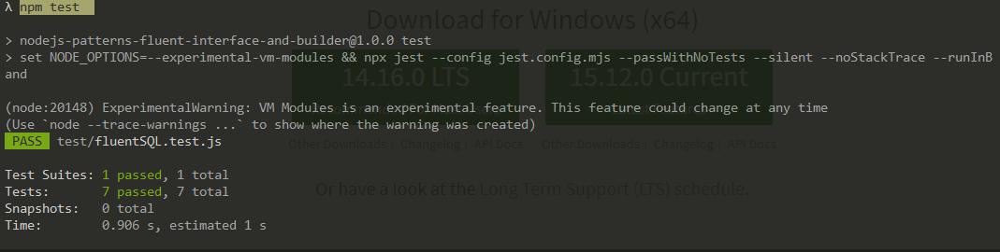
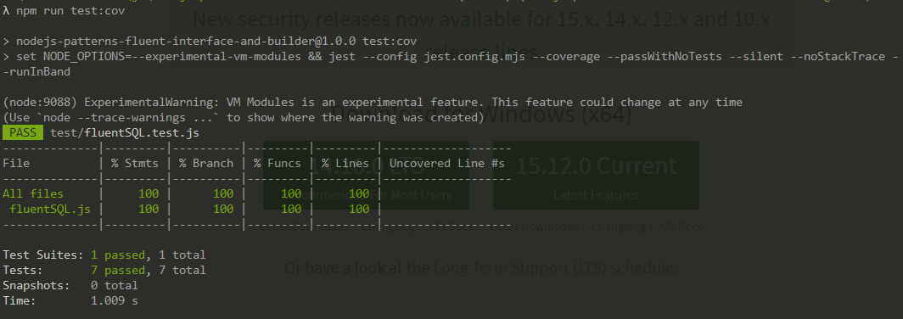
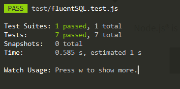
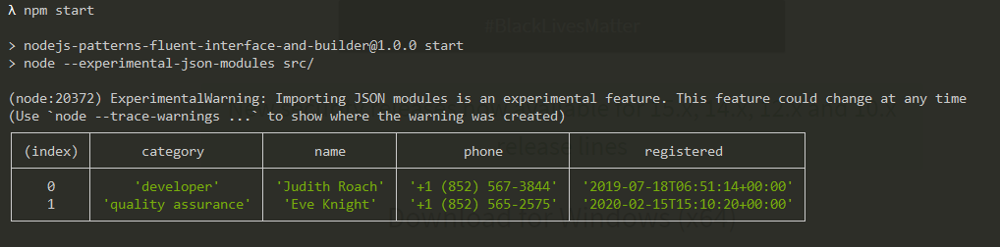

  <a href="#-projeto">Projeto</a>&nbsp;&nbsp;&nbsp;|&nbsp;&nbsp;&nbsp; 
  <a href="#-como-rodar">Como rodar</a>&nbsp;&nbsp;&nbsp;|&nbsp;&nbsp;&nbsp;
  <a href="#-como-contribuir">Como contribuir</a>&nbsp;&nbsp;&nbsp;
 

 

#  Trabalhando com os Design Patterns Fluent Interface e Builder - Pré

  

  

  

  

## 🚀 Tecnologias

Esse projeto foi desenvolvido com as seguintes tecnologias:

- [Yarn](https://yarnpkg.com/) - 1.22.4
- [Npm](https://www.npmjs.com/) - 6.14.5
- [NodeJS](https://nodejs.org/en/) - v15.12.0
- [JavaScript](https://developer.mozilla.org/pt-BR/docs/Web/JavaScript)

## 💻 Projeto

Projeto com Node.js fazendo filtros em uma base e usando TDD.

Esse projeto pratico da [Erick Wendel](https://www.youtube.com/watch?v=Gvamncn_wG0&t=381s).
Codigo da aula [aqui](https://github.com/ErickWendel/fluentsql-jest-tdd-yt).

## 🚀 Como Rodar

- Clone o projeto.
- npm install.
- 'npm start' para usar o index com os filtros.
- 'npm test' para usar os test.
- 'npm run test:cov' para verificar a cobertura dos test.
- 'npm run test:watch' para ficar escutando os test.

## 🤔 Como contribuir

- Faça um fork desse repositório;
- Cria uma branch com a sua feature: `git checkout -b minha-feature`;
- Faça commit das suas alterações: `git commit -m 'feat: Minha nova feature'`;
- Faça push para a sua branch: `git push origin minha-feature`.

Depois que o merge da sua pull request for feito, você pode deletar a sua branch.

